# MMSP Project Setup Guide

## 🛠️ 1. Install XAMPP
- Download and install XAMPP from [https://www.apachefriends.org/](https://www.apachefriends.org/)
- Launch the XAMPP Control Panel
- Start the **Apache** and **MySQL** services

## 🗄️ 2. Import `mmsp.sql`
- Open [phpMyAdmin](http://localhost/phpmyadmin)
- Create a new database named `mmsp`
- Go to the **Import** tab and upload `mmsp.sql` file

## 🔄 3. Clone the Project
Open your terminal and run the following inside the `xampp/htdocs` directory:

```bash
cd xampp/htdocs
git clone <your-repo-url> hello
```

> Replace `<your-repo-url>` with the actual Git repository URL.

## 🌐 4. Open in Browser
Paste the following link into your browser:

```
http://localhost/hello/homepage.php
```

---

## 🖼️ Project Screenshots

### Login Popup
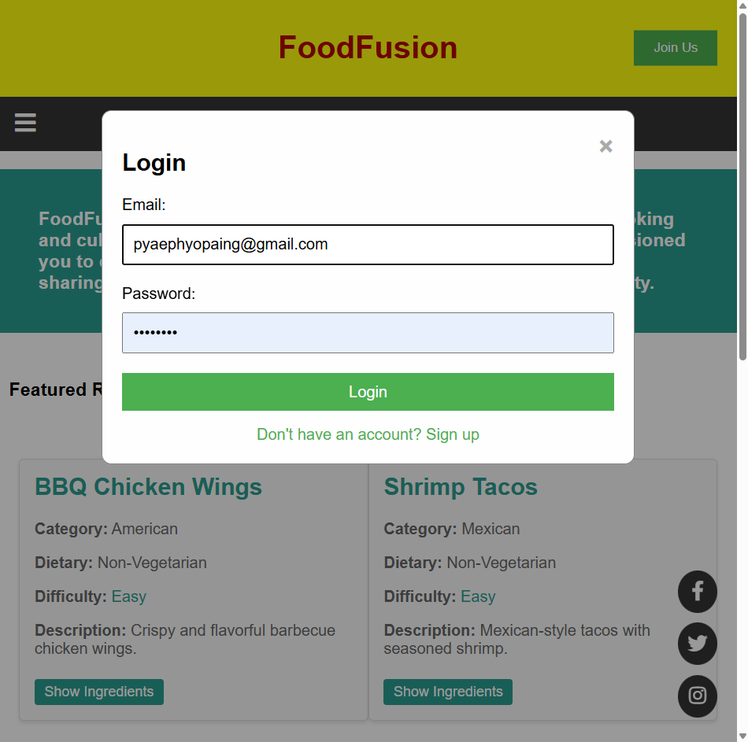

### Register Popup
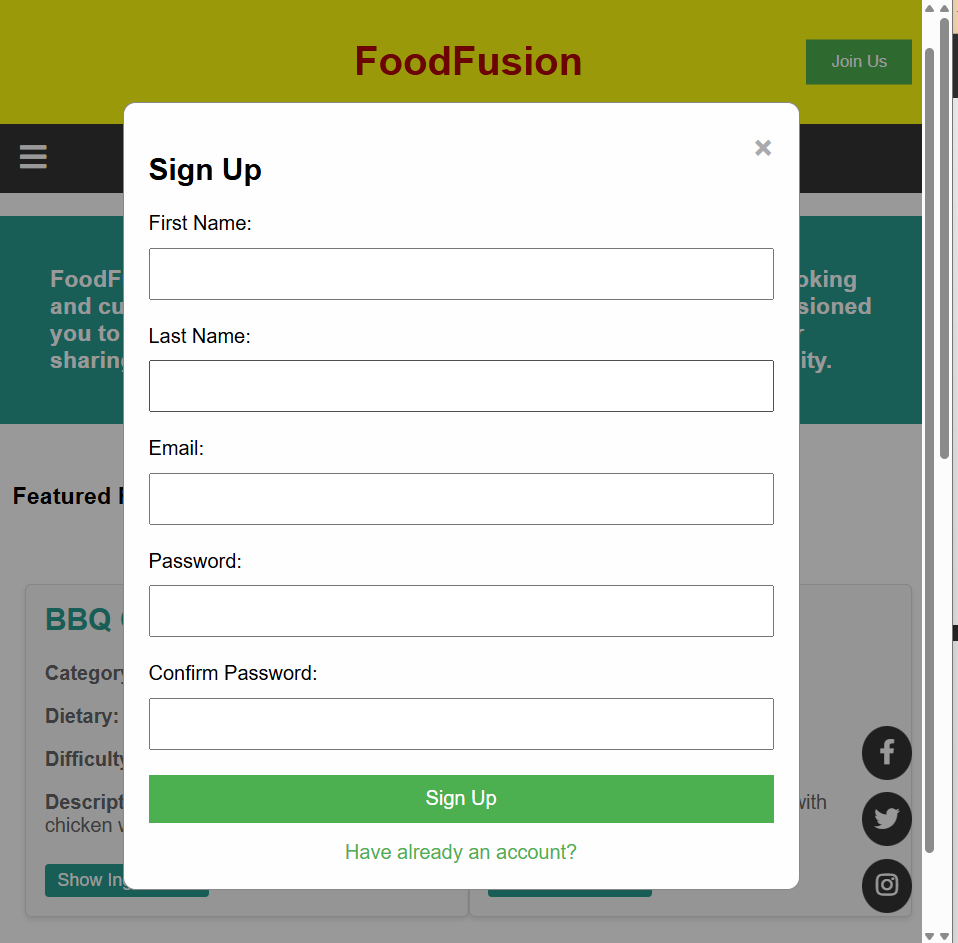

### 1. Home Page
**Window View**  


**Mobile View**  
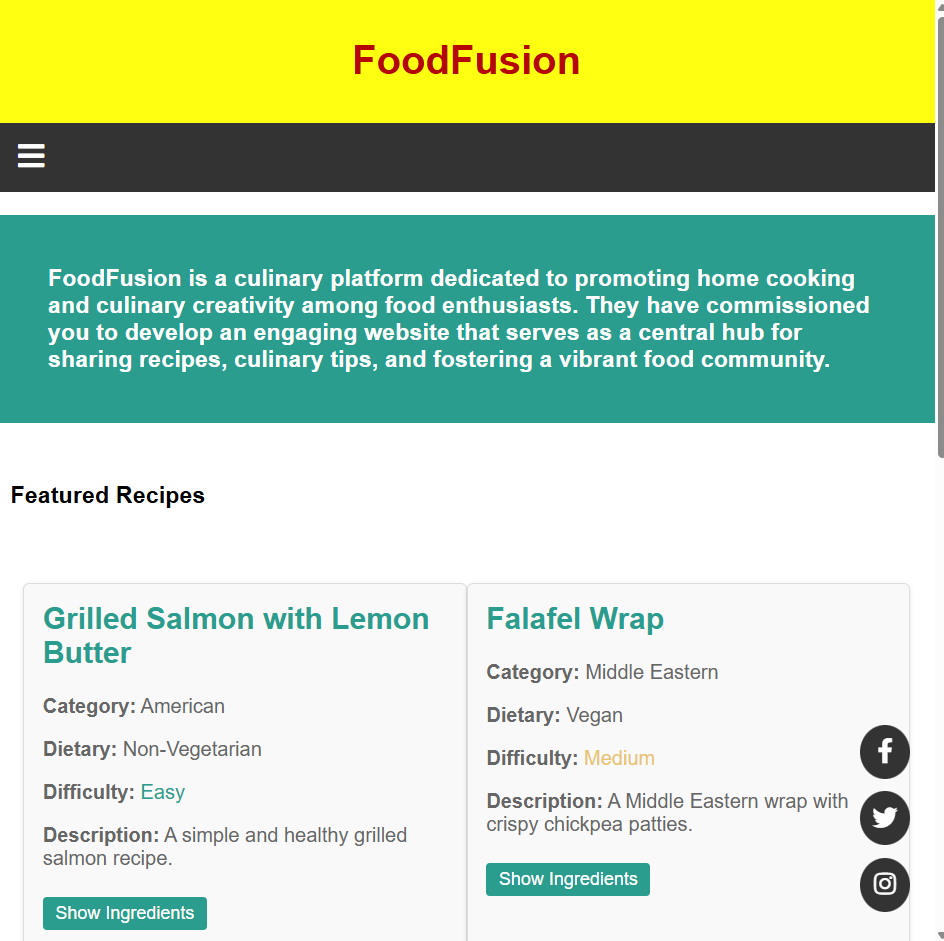

---

### 2. About Us
**Window View**  


**Mobile View**  


---

### 3. Recipe Collections
**Window View**  
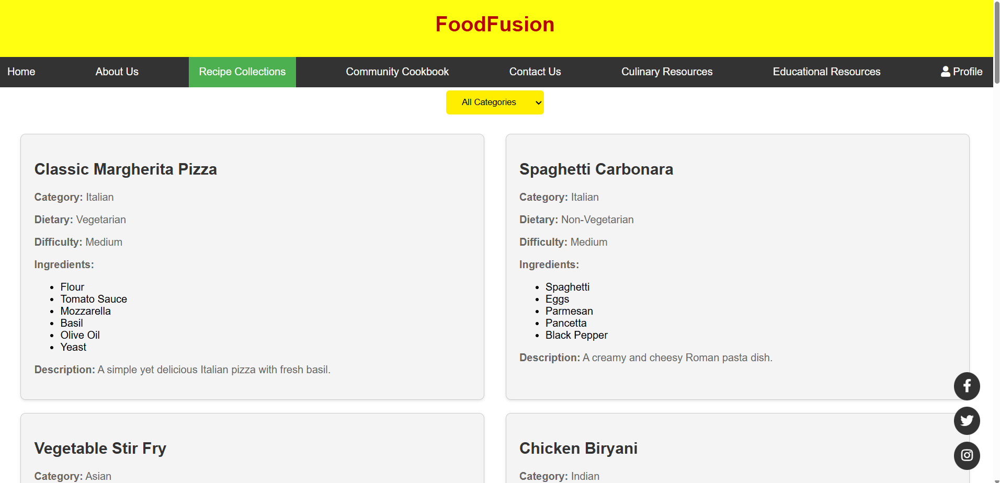

**Mobile View**  
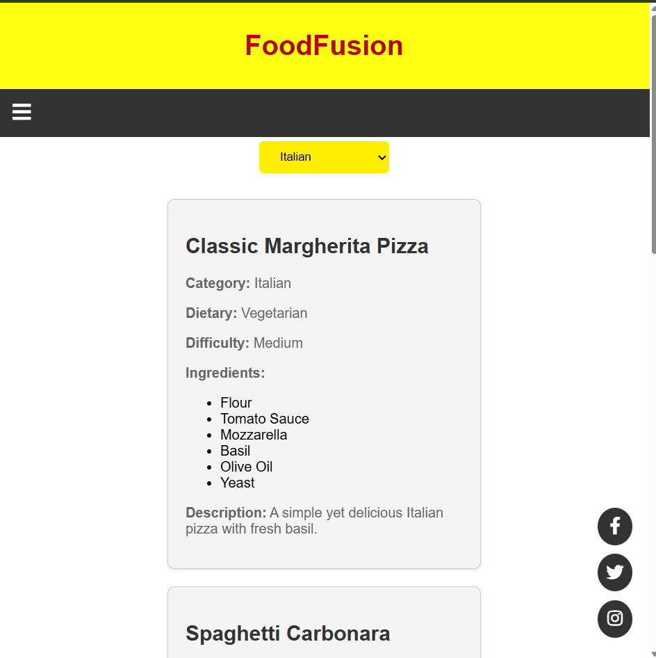

---

### 4. Community Cookbook
**Window View**  
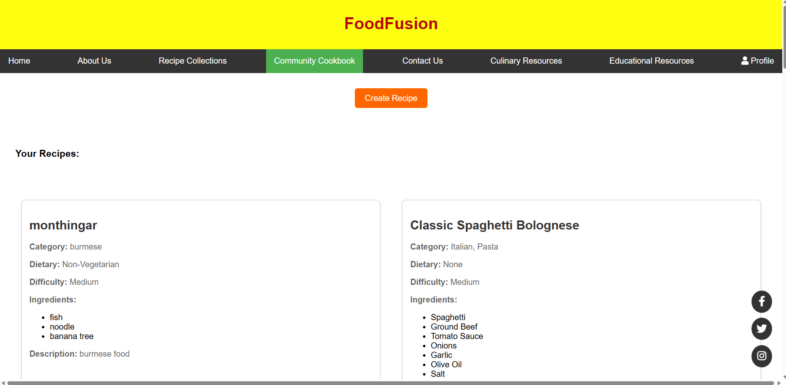

**Mobile View**  
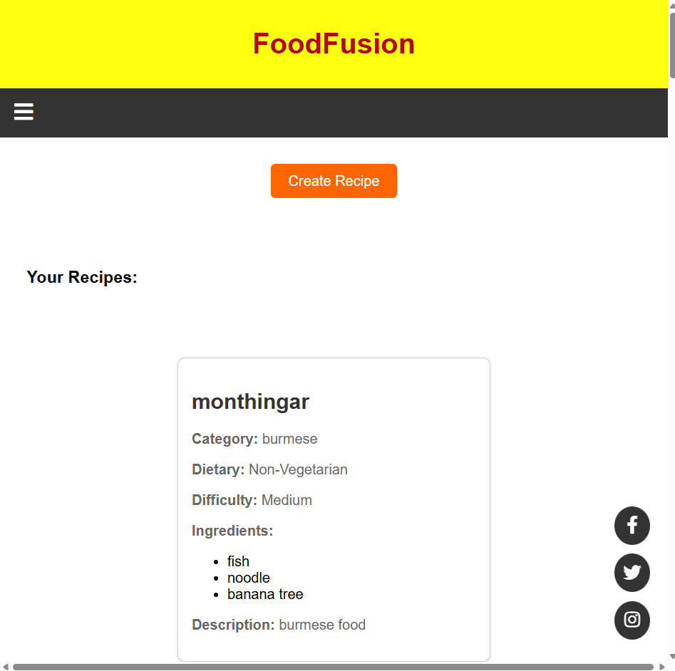

---

### 5. Contact Us
**Window View**  
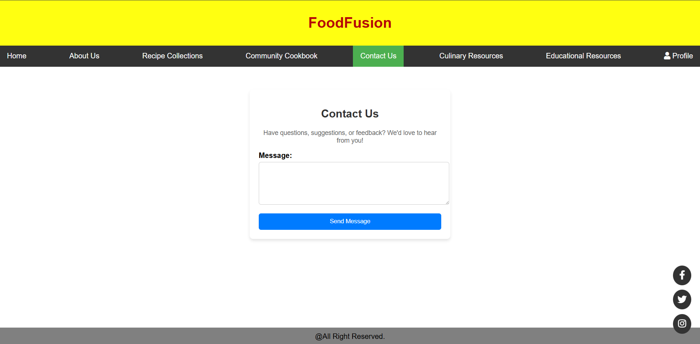

**Mobile View**  
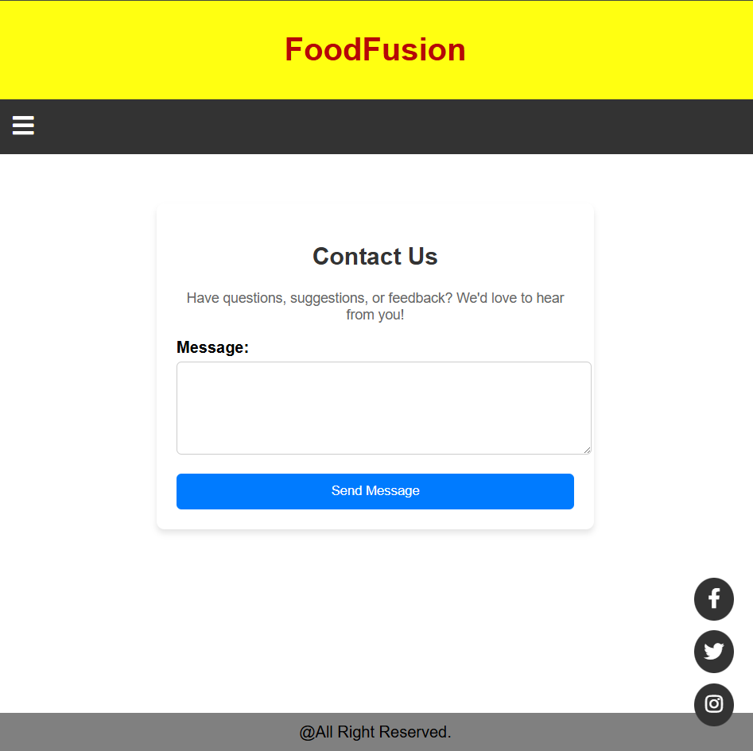

---

### 6. Culinary Resources
**Window View**  


**Mobile View**  


---

### 7. Educational Resources
**Window View**  
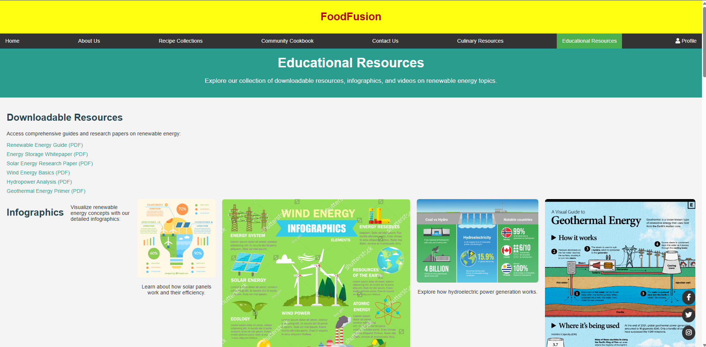

**Mobile View**  
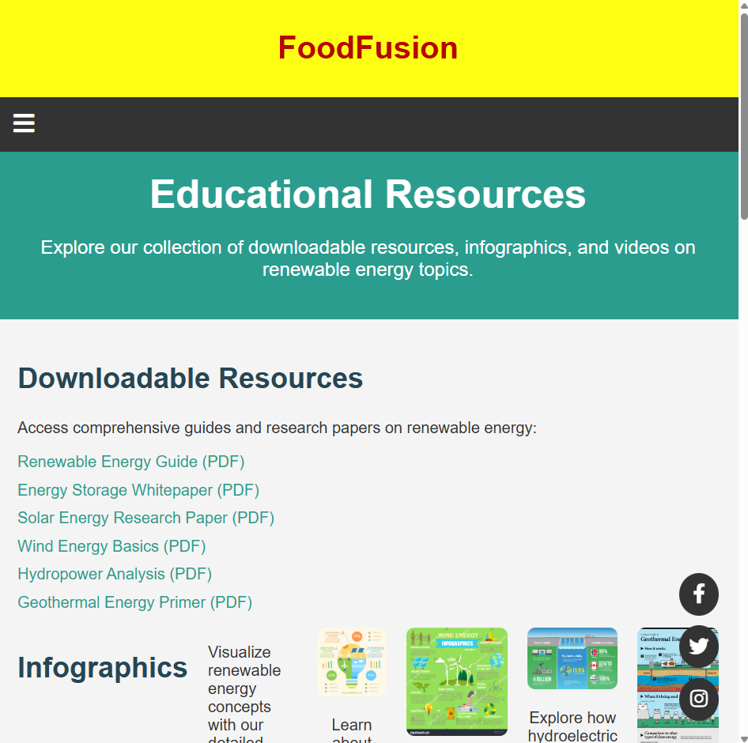

---

### 8. Profile

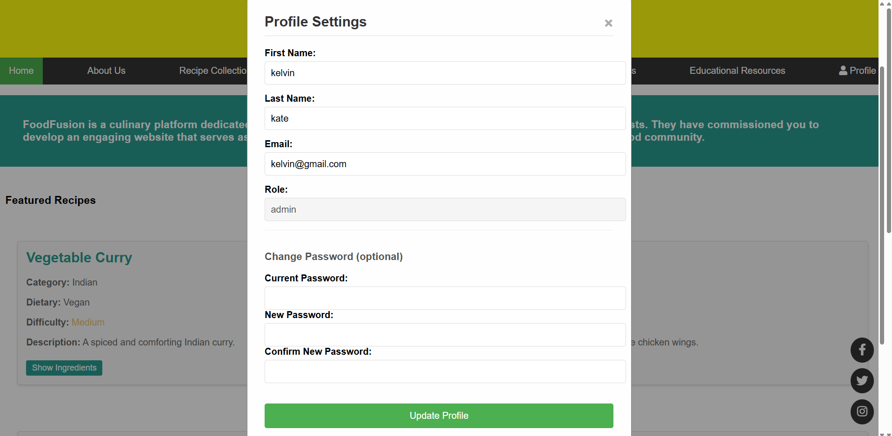

